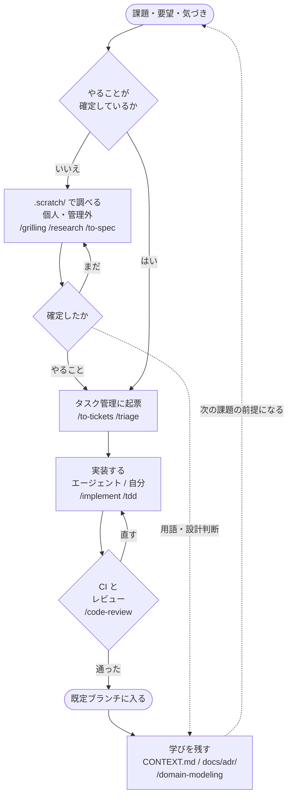

# 新規参画者ガイド

**読み手**: このプロジェクトに参加した開発者。

このプロジェクトはコーディングエージェント（GitHub Copilot、Claude Code など）を前提に運用している。エージェントが読む設定がリポジトリに入っていて、**あなたが書くものもエージェントが読む**。その前提を最初に共有するためのガイド。

> **このガイドは雛形として配布されている。** 次の 3 箇所をプロジェクトごとに書き換え、書き換えたらこの引用ブロックごと消すこと。
>
> - 「このプロジェクトについて」— 何を作っているのか
> - 「最初にやること」の 4 — 開発環境の立ち上げ方
> - 「困ったとき」— 相談先

## このプロジェクトについて

（何を作っているプロジェクトなのかを 2〜3 文で書く。ドメインの用語は `CONTEXT.md` に定義がある。）

## 最初にやること

### 1. エージェントの設定が読まれることを知る

リポジトリ直下の `AGENTS.md` に、このプロジェクトでの働き方が書いてある。**エージェントは起動時にこれを自動で読む。** あなたも一度読んでおくこと。ここに書いてあることが、エージェントの振る舞いの既定値になる。

`CLAUDE.md` は `AGENTS.md` を取り込むだけのファイル。Claude Code が `AGENTS.md` を読まないため置いてある。

### 2. skill を導入する

このプロジェクトは skill（エージェントが必要に応じて読む手順書）を前提にしている。手順は `docs/skills.md`。

**`/setup-matt-pocock-skills` は実行しないこと。** このプロジェクトの設定を標準テンプレートで上書きしてしまう。

導入されているか確認する。

```
copilot skill list
```

Claude Code なら `/` を入力して候補に出るかを見る。

### 3. 探索領域を用意する

調査や設計の途中経過は `.scratch/` に置く。**バージョン管理外**なので、あなたのマシンにしか存在しない。`.gitignore` に入っていることを確認する。

```
grep scratch .gitignore
```

### 4. 開発環境を立ち上げる

（このプロジェクトのセットアップ手順を書く。依存のインストール、テストの実行方法、ローカルでの起動方法など。）

## 作業の流れ

このプロジェクトは、作業の置き場所を**確定度で 2 つに分けている**。

| 段階 | 置き場所 | 何を置くか |
| --- | --- | --- |
| 探索 | `.scratch/`（個人・管理外） | 答えがまだ確定していない調査、設計、プロトタイプ |
| 実装 | タスク管理（トラッカー） | やることが確定した作業 |

**確定していないものをタスク管理に置かない。** 逆に、確定したものを `.scratch/` に置いたままにしない。用語が固まったら `CONTEXT.md`、設計判断が固まったら `docs/adr/`、実装作業が固まったらタスク管理に移す。

### 全体の流れ



上から下が 1 周。**確定していないものは `.scratch/` で確定させてから起票する**——ここを飛ばすと、仕様が定まらないまま実装が始まる。

右側の点線が**戻りの流れ**。`.scratch/` で用語や設計判断が固まったら、実装を待たずに `CONTEXT.md` と `docs/adr/` へ移す。マージ後も同じ。**マージして終わりにすると、次の人が同じ議論をやり直すことになる。**

triage で `needs-info` が付いたものは、情報が揃うまで実装に進まない。ラベルの意味は `docs/agents/triage-labels.md` にある。

### フェーズごとに使う skill

図に入りきらないものも含めた一覧。**どれを使えばよいか分からないときは `/ask-matt` が案内する。**

| フェーズ | skill | 使いどころ |
| --- | --- | --- |
| 確定させる | `/grilling` | 計画や決定を問い詰めて曖昧さを潰す |
| | `/grill-with-docs` | 同上。用語集と ADR を書きながら進める |
| | `/research` | 一次情報に当たって調べ、結果を残す |
| | `/prototype` | 使い捨ての実装で設計判断を確かめる |
| | `/to-spec` | 会話の内容を spec にまとめる |
| | `/wayfinder` | 1 セッションに収まらない規模を地図に分解する |
| 起票 | `/to-tickets` | spec や計画を実装チケットに割る |
| | `/triage` | ラベルを付けて状態を進める |
| 実装 | `/implement` | spec やチケットから実装する |
| | `/tdd` | テストを先に書いて進める |
| | `/diagnosing-bugs` | 原因の分からない不具合や性能退行を切り分ける |
| | `/resolving-merge-conflicts` | マージ衝突を解消する |
| レビュー | `/code-review` | 規約と spec の 2 軸で差分を見る |
| 残す | `/domain-modeling` | 用語集と ADR を育てる |
| 横断 | `/ask-matt` | どの skill を使うか分からないとき |
| | `/handoff` | 会話を引き継ぎ文書に圧縮する |

**`/to-spec` は起票ではなく確定させるフェーズ。** 出力先は `.scratch/` で、タスク管理に載せるのは `/to-tickets` の役目。振り分けの正本は `docs/agents/issue-tracker.md` にある。

導入されていない skill もある。手元で使えるものは `copilot skill list`、または Claude Code で `/` を入力して確かめる。

skill ごとの振り分けは `docs/agents/issue-tracker.md` の表にある。表に無い skill を使うときは、自分で判断せず確認すること。

## 守ること

`AGENTS.md` に書いてある規約は、エージェントだけでなく**あなたにも適用される**。要点は次の 4 つ。

- **バージョン管理の履歴を書き換えない** — force push、`reset --hard`、push 済みコミットの amend
- **既定ブランチには変更提案（pull request / merge request）経由で入れる**
- **テストや lint を通すために無効化や条件緩和をしない** — 失敗はそのまま報告する
- **認証情報を出力・送信しない**

コミットメッセージは Conventional Commits の形式に日本語の説明を組み合わせる。書式と例は `AGENTS.md` にある。

## ドキュメントの地図

読む必要があるものだけを挙げる。上から順に、参加直後に読む価値が高い。

| ファイル | 何が書いてあるか |
| --- | --- |
| `AGENTS.md` | このプロジェクトでの働き方。**最初に読む** |
| `CONTEXT.md` | ドメイン用語集。概念の呼び方に迷ったら見る |
| `docs/skills.md` | skill の導入手順 |
| `docs/agents/issue-tracker.md` | 作業をどこに置くかの振り分け |
| `docs/agents/triage-labels.md` | triage のラベル語彙 |
| `docs/adr/` | 設計決定と、その理由。「なぜこうなっているのか」を調べるとき |
| `docs/agents/domain.md` | `CONTEXT.md` と `docs/adr/` の読み方・書き方 |
| `docs/github/`（あれば） | GitHub 固有の手順。ラベル、ブランチ保護、CI |

`docs/template/` があっても読まなくてよい。このリポジトリの土台になったテンプレート自体の記録で、このプロジェクトの内容ではない。

## 用語や設計を追記するとき

**先回りして書かない。** `CONTEXT.md` も `docs/adr/` も、実際に必要になった時点で追記する。

- **用語** — 同じ概念に複数の呼び方が出てきて混乱したとき、`CONTEXT.md` に定義する
- **設計決定** — 「取り消しが難しい」「文脈がないと驚く」「実在のトレードオフの結果」の 3 つをすべて満たすとき、`docs/adr/` に記録する。基準の詳細は `docs/adr/README.md`

どちらも `/domain-modeling` skill が支援する。

## 困ったとき

（相談先を書く。チャンネル名、担当者、定例の場など。）

CI が落ちたときの対処は `README.md` の「CI の検査」節にある。
