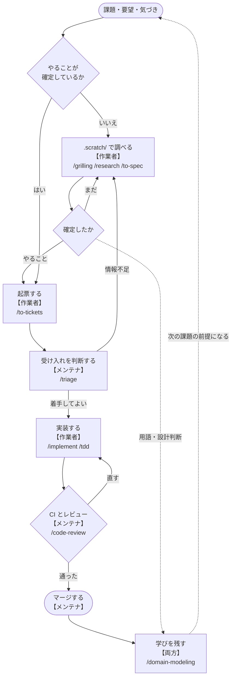
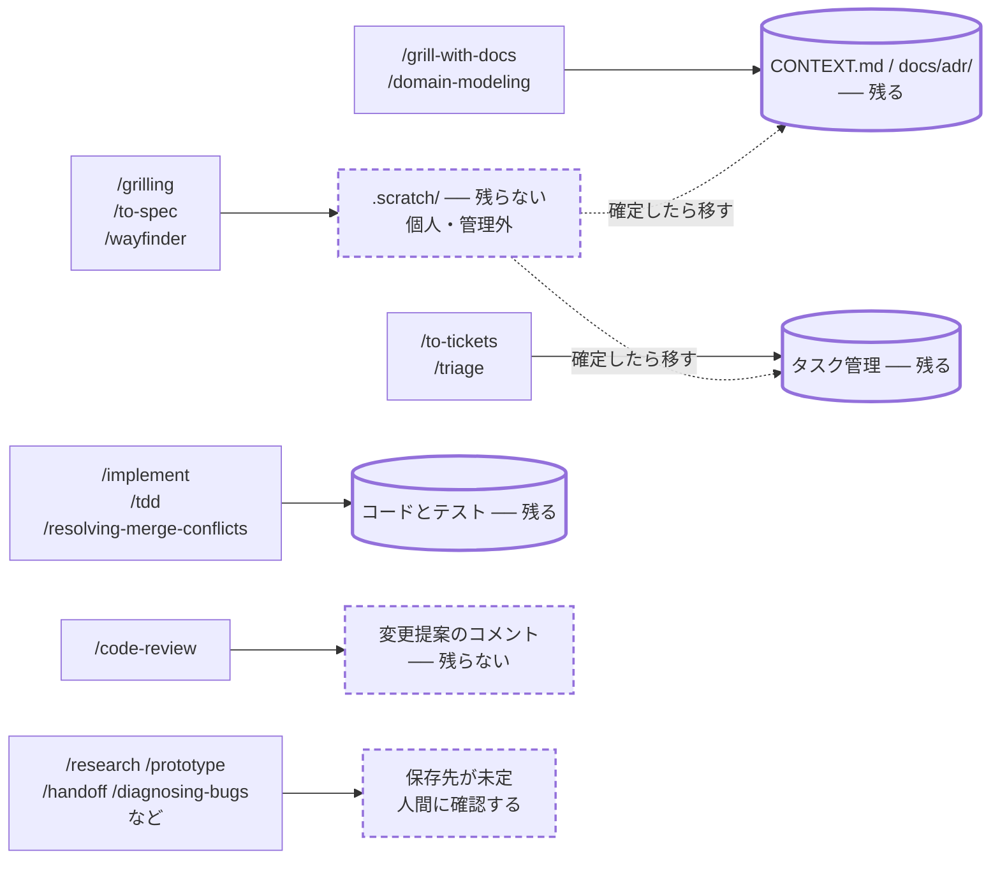

# 開発の流れ

**読み手**: 全体像を知りたくなった人。**参加するだけなら読まなくてよい**（`docs/onboarding.md` の 1 ページで足りる）。

ここにあるのは、必要になったときに引く参照。上から順に読む必要はない。

## 2 つの役割

この文書は 2 つの役割を区別して書いてある。**人事上の役職ではなく、このリポジトリ上の役割**であり、同じ人が両方を兼ねることもある。

| 役割 | 持つもの |
| --- | --- |
| **作業者** | 課題を調べ、起票し、実装し、変更提案を出す。参加者の既定はこちら |
| **メンテナ** | 受け入れの判断、レビューとマージ、リポジトリの設定（ラベル、ブランチ保護、CI） |

`docs/agents/triage-labels.md` の `needs-triage`（メンテナが評価する必要がある）や、`docs/github/branch-protection.md` の設定手順は、いずれもメンテナ側の作業を指している。

**自分がどちらか分からないときは、マージ権限があるかで判断する。** 権限があればメンテナ側の責務も持つ。

## 作業の流れ

このプロジェクトは、作業の置き場所を**確定度で 2 つに分けている**。

| 段階 | 置き場所 | 何を置くか |
| --- | --- | --- |
| 探索 | `.scratch/`（個人・管理外） | 答えがまだ確定していない調査、設計、プロトタイプ |
| 実装 | タスク管理（トラッカー） | やることが確定した作業 |

**確定していないものをタスク管理に置かない。** 逆に、確定したものを `.scratch/` に置いたままにしない。用語が固まったら `CONTEXT.md`、設計判断が固まったら `docs/adr/`、実装作業が固まったらタスク管理に移す。

### 全体の流れ

上から下が 1 周。**確定していないものは `.scratch/` で確定させてから起票する**——ここを飛ばすと、仕様が定まらないまま実装が始まる。

右側の点線が**戻りの流れ**。`.scratch/` で用語や設計判断が固まったら、実装を待たずに `CONTEXT.md` と `docs/adr/` へ移す。マージ後も同じ。**マージして終わりにすると、次の人が同じ議論をやり直すことになる。**

triage で `needs-info` が付いたものは、情報が揃うまで実装に進まない。ラベルの意味は `docs/agents/triage-labels.md` にある。

### フェーズごとに使う skill

図に入りきらないものも含めた一覧。**どれを使えばよいか分からないときは `/ask-matt` が案内する。**

| フェーズ | 担当 | skill | 使いどころ |
| --- | --- | --- | --- |
| 確定させる | 作業者 | `/grill-with-docs` | **既定。** 計画や決定を問い詰めながら、確定した用語を `CONTEXT.md` に、判断を `docs/adr/` に書いていく |
| | 作業者 | `/grilling` | 記録が要らないとき。問い詰めるだけで文書は残らない |
| | 作業者 | `/research` | 一次情報に当たって調べ、結果を残す |
| | 作業者 | `/prototype` | 使い捨ての実装で設計判断を確かめる |
| | 作業者 | `/to-spec` | 会話の内容を spec にまとめる |
| | メンテナ | `/wayfinder` | 1 セッションに収まらない規模を地図に分解する |
| 起票 | 作業者 | `/to-tickets` | spec や計画を実装チケットに割る |
| 受け入れ | メンテナ | `/triage` | ラベルを付けて状態を進める |
| 実装 | 作業者 | `/implement` | spec やチケットから実装する |
| | 作業者 | `/tdd` | テストを先に書いて進める |
| | 作業者 | `/diagnosing-bugs` | 原因の分からない不具合や性能退行を切り分ける |
| | 作業者 | `/resolving-merge-conflicts` | マージ衝突を解消する |
| レビュー | メンテナ | `/code-review` | 規約と spec の 2 軸で差分を見る |
| 残す | 両方 | `/domain-modeling` | 用語集と ADR を育てる |
| | 両方 | `/writing-for-agents` | skill や `AGENTS.md` を書く・直す。手順を skill にするときはこれ（`docs/skills-authoring.md`） |
| 横断 | 両方 | `/ask-matt` | どの skill を使うか分からないとき |
| | 両方 | `/handoff` | 会話を引き継ぎ文書に圧縮する |

**担当は既定であって、禁止ではない。** 作業者が `/code-review` を自分の差分に当ててから出してもよいし、メンテナが実装してもよい。分けているのは**責任の所在**であって、道具の使用権ではない。

**設計を詰めるときは `/grilling` ではなく `/grill-with-docs` を既定にする。** 両者の違いは記録が残るかどうかだけで、詰めた結果を書き残さないと、確定した用語も判断も次の人に伝わらない。`CONTEXT.md` と `docs/adr/` が空のまま古びる原因はたいていここにある。

### skill が何をどこに書くか

左が skill、右が保存先。**円柱は残るもの、破線は残らないもの。**

**`.scratch/` に書くものは消えてよい。** バージョン管理外で、他人には見えない。残したければ点線のとおり移す必要がある。

**`/grill-with-docs` だけが、詰めた結果を直接リポジトリの記憶に書く。** これが `/grilling` との唯一の違いで、既定にする理由でもある。

図に保存先を書いてあるのは `docs/agents/issue-tracker.md` の振り分け表に載っている skill と、出力先が自明なものだけ。**それ以外は保存先が決まっていないので、勝手に決めずに確認すること。** 例えば `/research` は説明上リポジトリ内にファイルを作るとされていて、`.scratch/` とは扱いが違う。

**`/to-spec` は起票ではなく確定させるフェーズ。** 出力先は `.scratch/` で、タスク管理に載せるのは `/to-tickets` の役目。振り分けの正本は `docs/agents/issue-tracker.md` にある。

導入されていない skill もある。手元で使えるものは `copilot skill list`、または Claude Code で `/` を入力して確かめる。

skill ごとの振り分けは `docs/agents/issue-tracker.md` の表にある。表に無い skill を使うときは、自分で判断せず確認すること。

### メンテナだけがやること

作業者は読み飛ばしてよい。ただし**誰かが必ずやる必要がある**ので、メンテナが不在のプロジェクトでは作業者が兼ねる。

- **受け入れの判断** — 起票されたものに `needs-triage` から始まるラベルを付け、`ready-for-agent` / `ready-for-human` / `needs-info` / `wontfix` のどれかへ進める（`docs/agents/triage-labels.md`）
- **レビューとマージ** — 変更提案を承認し、既定ブランチに入れる
- **リポジトリの設定** — ラベルの作成、ブランチ保護、CI の required status check（`docs/github/` 配下）
- **設定の維持** — `AGENTS.md` と `docs/agents/` を実態に合わせて更新する。skill の導入方針とバージョンの更新（`docs/skills.md`、`README.md` の「ツールのバージョン更新」）

**CI が赤いまま放置されないようにするのもメンテナの責務。** ブランチ保護を設定していないリポジトリでは、CI が落ちていてもマージできてしまう。

### 参加した人に最初に渡すもの

**練習用の課題ではなく、タスク管理から引いた本物の課題を渡す。** 2 週間で出荷できる粒度に切り、相談相手を 1 人決めて明示する。Stripe や Google が公開している新人受け入れの設計に共通する形で、いずれも「質問に答えること」を誰かの職務として明文化している点が要点。**「困ったら誰にでも聞いて」は、誰にも聞けないのと同じ。**

`docs/onboarding.md` の「詰まったら」に相談先が書いてあること。空欄のままなら、渡す前に埋める。

## ドキュメントの地図

必要になったときに引くもの。**上から順に読む必要はない。**

| ファイル | いつ見るか |
| --- | --- |
| `docs/onboarding.md` | 参加した直後。**これだけで作業を始められる** |
| `CONTEXT.md` | 概念の呼び方に迷ったとき |
| `AGENTS.md` | エージェントが何を前提に動くかを知りたいとき（エージェントは自動で読む） |
| `docs/skills.md` | skill を導入・更新するとき |
| `docs/skills-authoring.md` | このプロジェクト固有の skill を自分で書くとき |
| `docs/agents/issue-tracker.md` | 作業をどこに置くかの振り分け |
| `docs/agents/triage-labels.md` | triage のラベル語彙 |
| `docs/adr/` | 設計決定と、その理由。「なぜこうなっているのか」を調べるとき |
| `docs/agents/domain.md` | `CONTEXT.md` と `docs/adr/` の読み方・書き方 |
| `docs/github/`（あれば） | GitHub 固有の手順。ラベル、ブランチ保護、CI |
| `scripts/verify.py` | 設定が壊れていないか確かめるとき |

`docs/template/` があっても読まなくてよい。このリポジトリの土台になったテンプレート自体の記録で、このプロジェクトの内容ではない。

## 用語・設計・手順を追記するとき

**先回りして書かない。** どれも、実際に必要になった時点で追記する。

- **用語** — 同じ概念に複数の呼び方が出てきて混乱したとき、`CONTEXT.md` に定義する
- **設計決定** — 「取り消しが難しい」「文脈がないと驚く」「実在のトレードオフの結果」の 3 つをすべて満たすとき、`docs/adr/` に記録する。基準の詳細は `docs/adr/README.md`
- **手順・レビュー観点** — 特定の場面でだけ必要な進め方を、毎回説明し直していると気づいたとき、`.claude/skills/` に skill として置く。書き方は `docs/skills-authoring.md`

用語と設計決定は `/domain-modeling` skill が支援する。

**3 つの境目。**「それが何であるか」は `CONTEXT.md`、「なぜそうしたか」は `docs/adr/`、「どう進めるか」は skill。skill に用語や決定を書き写すと、更新したときに片方だけ古くなる。
